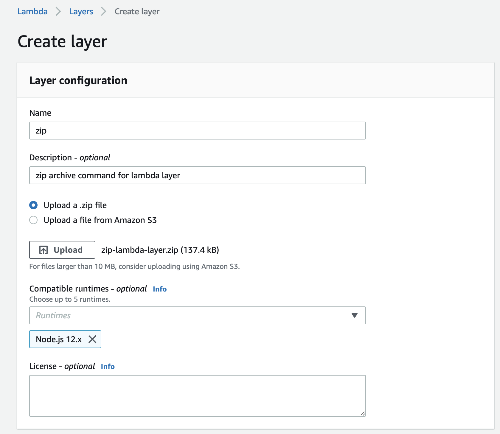
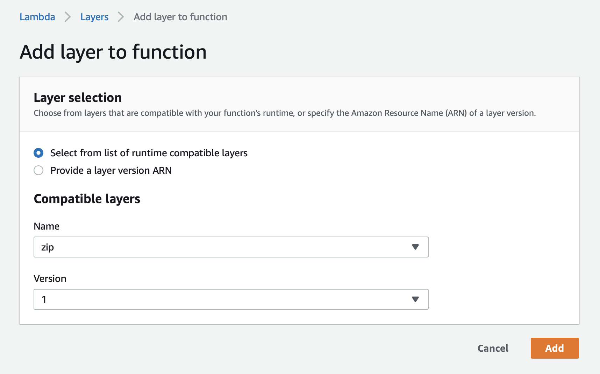

# Zip for AWS Lambda as layer

[Zip](http://infozip.sourceforge.net/Zip.html) archive command for AWS Lambda layer.

## Getting Started

You can get `zip-lambda-layer.zip` file the following build command via Docker.

```
$ docker build -t zip-lambda-layer .
$ docker run -v "${PWD}/dist":/tmp/zip-lambda-layer zip-lambda-layer:latest
```

Click on Layers and click "Create Layer", upload `zip-lambda-layer.zip`, choose the runtime you need, and other inputs like the following image.



Click "Add a layer" your lambda function Designer, and add it.


